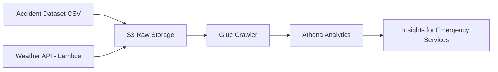

# Business Documentation – Traffic Accident & Weather Analytics

---

## 1. Stakeholders & Business Value

### Primary Stakeholders – Emergency Services
This project is primarily designed to support **first responder organizations**, including:
- Ambulance services  
- Fire departments  
- Police forces  

These organizations must continuously make decisions about **staffing, resource allocation, and preparedness**. Having insight into how weather affects accident patterns helps them become more proactive instead of reactive.

---

### Secondary Stakeholders
While first responders are the main focus, the insights are also valuable for:
- Government transport authorities  
- Road safety agencies  
- Hospitals and health systems  
- Urban planners and public safety departments  
- The insurance industry

---

## Business Value

The project provides data-driven support for improving **public safety operations**:

### Operational Readiness
- Identify weather conditions that significantly increase accident risk  
- Prepare resources ahead of time based on weather forecasts  
- Reduce unexpected workload spikes

### Efficient Staffing & Resource Allocation
- Avoid under-staffing on days with high weather risk  
- Avoid unnecessary over-staffing on normal weather days  
- Optimize ambulance, patrol, and fire unit availability

### Improved Response & Public Safety
- Faster reaction capability  
- Better distributed patrol and ambulance locations  
- Potentially life-saving impact

### Economic & Organizational Benefit
- Better efficiency and reduced operational waste  
- Data-driven justification for decisions  
- Ability to support funding and policy discussions

Overall, the project enables **smarter, safer, and more cost-efficient emergency planning**.

---

## 2. Pipeline Architecture & Business Justification

---

## Architecture Overview

The project is implemented as a modern, cloud-based analytics pipeline using AWS.

---

### Key Components

- **AWS S3**  
  Serves as a data lake storing raw accident data, collected weather data, and the curated joined dataset

- **AWS Lambda**  
  Automatically retrieves external weather data via API and writes it to S3

- **AWS Glue Crawler**  
  Detects schema and builds the AWS Data Catalog

- **AWS Athena**  
  Performs queries, joins both datasets, and enables analytics without needing servers

- **External Weather API (Open-Meteo)**  
  Free and reliable weather source

---

## Cost & Feasibility

A great benefit of this architecture is that it is **serverless, scalable, and cost-efficient**.  
Costs are primarily driven by:
- small S3 storage fees  
- minimal Lambda execution time  
- Athena queries only when used  

Based on prior calculation and expected workload, the monthly cost is estimated to be in the range of **~20–30 USD**, making it highly realistic and affordable even for public sector organizations.

This means the system is not only technically feasible, but also **financially practical**.

---

## 3. KPIs – Measuring Project Success

To evaluate whether this project truly supports emergency services, I would recommend the following **business-focused KPIs**: 

---

### KPI 1 — Weather Risk Predictability
**Question:**  
Can weather meaningfully help predict accident risk?

This is a good KPI because it shows the strength of the relationship between weather conditions and accident frequency, and whether weather-aware staffing decisions are justified.

---

### KPI 2 — High-Risk Weather Accident Share
**Question:**  
What proportion of accidents occur during risky weather conditions?

This KPI is important because if a large percentage of accidents occur in bad weather, there is strong justification for weather-based planning.

---

### KPI 3 — Operational Impact KPI
**Question:**  
Does weather significantly change the expected workload for first responders?

This KPI highlights the difference between average accident volume in normal vs risky weather. If this difference is meaningful, emergency services can benefit from adjusting readiness and staffing according to forecasted conditions.

---

---

## 4️. Operational Outcomes & Recommendations

While the project was primarily analytical, the goal was always to deliver **practical business insight** for emergency services and public safety planning. Based on the analysis results, the following conclusions can be drawn.

---

### When are accidents most likely to increase?

#### 4.1 Strong Wind Conditions
Wind showed the clearest measurable relationship with increased accident occurrence.  
This suggests that vehicle control becomes more difficult and road environments become riskier during windy periods.

**Operational implication:**  
Emergency services should consider higher readiness levels when strong winds are forecasted.

---

#### 4.2 Rainy Weather – Especially on B-Roads
Rain showed meaningful behavioral and environmental impact:

- Light rain still results in a large number of accidents.
- B-class roads (road class 3) experience the highest number of rain-related accidents.
- Motorways and major A-roads appear less affected, likely due to better infrastructure.

**Operational implication:**  
Ambulance, police and fire units should expect more calls in rainy conditions, especially on secondary roads rather than highways.

---

#### 4.3️ Temperature Effects Exist but Are Less Dominant
Most accidents occur between **0–10°C and 10–20°C**, which matches normal driving seasons.  
Extreme temperatures did not produce significant spikes.

**Operational implication:**  
Temperature alone is not a strong enough driver to justify staffing changes, but should be considered in combination with wind and rain.

---

## 5. Business Value Summary

From a decision-making perspective, this project provides meaningful guidance:

- Helps **anticipate demand** instead of reacting to it  
- Supports **staffing and scheduling decisions**
- Enables **data-backed justification** for resourcing choices
- Improves preparedness for **high-risk weather conditions**

In practical terms, emergency services should consider increased readiness when:

- Strong winds are forecasted  
- Rain is expected, particularly affecting B-roads  
- Combined weather risk factors appear together

This transforms weather data into **actionable public safety intelligence**, supporting smarter, safer and more efficient emergency operations.

---

