# Implementation Documentation – Traffic Accident & Weather Analytics

This document describes the complete technical implementation of the project, including AWS setup, data ingestion, transformations, analytics, and conclusions. 

---

## 1️. Environment Setup

### 1.1 AWS Region
- Project Region: **us-east-1 (N. Virginia)**

### 1.2 AWS Services Used
- **Amazon S3** → Data lake storage  
- **AWS Lambda** → Collecting weather API data  
- **AWS Glue Crawler** → Schema discovery & Data Catalog  
- **Amazon Athena** → Query execution and analytics  

---

## 2️. S3 – Data Lake Setup

### 2.1 Bucket Structure

The project uses **one main S3 bucket**: traffic-accident-weather-sara


Inside this main data lake bucket, folders are used to separate different pipeline stages.

---

### Initial Structure
At the start of the project, three separate folders were created to represent **Raw → Curated pipeline layers**:

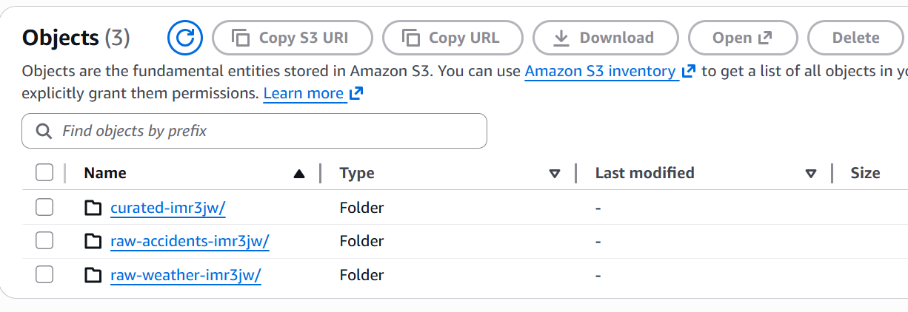

- `raw-accidents-imr3jw/`  
  Stores the original accident dataset uploaded to S3 without modification.

- `raw-weather-imr3jw/`  
  Stores weather data collected via the API in JSON format.

- `curated-imr3jw/`  
  Stores the final cleaned and enriched dataset after joining accidents and weather.
---

### Final Structure

During later development and while delivering the solution, additional folders were added to support Athena processing and updated Lambda output.

The final S3 structure looks like this:

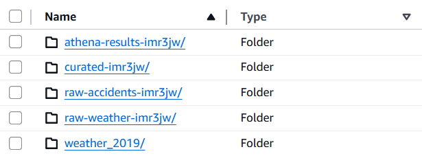

Explanation of final folders:

- `raw-accidents-imr3jw/`  
  Original accident data (unchanged, source of truth).

- `raw-weather-imr3jw/`  
  Weather API response files stored in S3.

- `weather_2019/`  
  A refined weather dataset created later in the project to improve usability and date matching with accident data.

- `curated-imr3jw/`  
  Final analytics-ready dataset containing **accidents joined with weather**.

- `athena-results-imr3jw/`  
  This folder is automatically created by **Amazon Athena** to store query result files.

---
---

## 3️. Accident Data Ingestion

### 3.1 Accident Dataset Source

The accident dataset used in this project was obtained from the official UK government open data portal:

https://www.data.gov.uk/dataset/6efe5505-941f-45bf-b576-4c1e09b579a1/road-traffic-accidents

The specific dataset used is the **2019 accident dataset**, which I uploaded to S3 under the filename: 


This dataset contains all officially recorded **road traffic accidents in the UK for the year 2019**, including detailed records for the city of Leeds.

---

### 3.2 Why 2019 Leeds Accidents?

For this project, Leeds was selected as the geographical focus area. This means:
- only accidents that occurred in **Leeds** were used in the analysis
- weather API calls were made specifically for Leeds coordinates
- all weather–accident relationships are therefore meaningful within a single city context
---

### 3.3 S3 Storage

The dataset was uploaded into:
`raw-accidents-imr3jw/` 

---

# 4. AWS Lambda – Weather Data Ingestion

AWS Lambda is responsible for retrieving **historical weather data** that corresponds to the accident records. Since the accident dataset contains only accident information but no weather conditions, Lambda enriches the dataset by fetching the weather data from an external API and storing it in S3 for later use.

---

## 4.1 Lambda Configuration

| Property | Value |
|--------|--------|
| Runtime | Python 3.x |
| Execution | On-demand (manual), extendable to scheduled |
| Region | us-east-1 |
| Memory | Default |
| Timeout | Adjusted to allow API execution |
| IAM Role | LabRole (with S3 read/write permission) |

Lambda is serverless, meaning:
- No servers to manage  
- Automatically scales  
- Only costs money when executed  

This makes it highly cost-efficient.

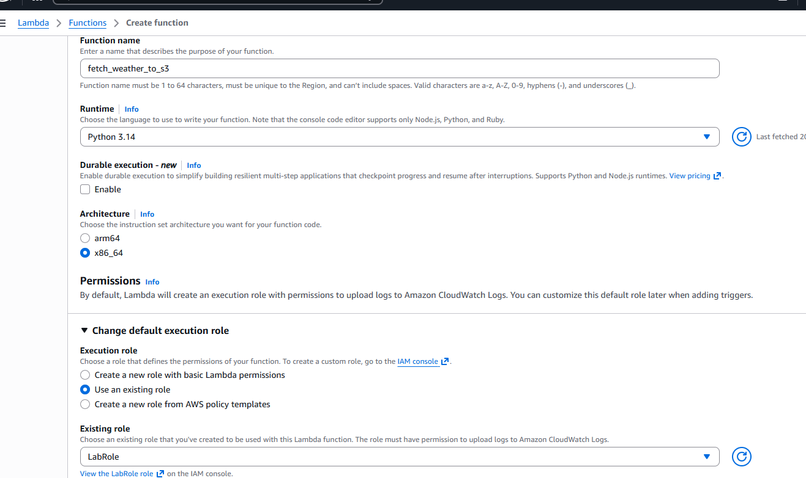

---

## 4.2 External Weather API

Lambda calls the **Open-Meteo Historical Weather API**, chosen because it is:

- Free to use  
- Reliable and well documented  
- Provides historical datasets  
- Contains weather metrics relevant to road safety  

Weather fields retrieved:
- Temperature  
- Wind speed  
- Precipitation  

---

## 4.3 Environment Variables

Lambda uses environment variables for flexibility and reusability:

| Key | Value | Purpose |
|-----|--------|--------|
| `BUCKET_NAME` | `traffic-accident-weather-sara` | Where results are stored |
| `WEATHER_PREFIX` | `raw-weather-imr3jw/` | Folder for weather files |

---

## 4.4 Code of lambda function

```python
import json
import boto3
import urllib3
import os

s3 = boto3.client("s3")
http = urllib3.PoolManager()

BUCKET = os.environ["BUCKET_NAME"]  
KEY_PREFIX = "raw-weather-imr3jw/weather_2019/"


def lambda_handler(event, context):

    latitude = 53.8137      
    longitude = -1.5607

    url = (
        "https://archive-api.open-meteo.com/v1/archive?"
        f"latitude={latitude}&longitude={longitude}"
        "&start_date=2019-01-01"
        "&end_date=2019-12-31"
        "&hourly=temperature_2m,wind_speed_10m,precipitation"
    )

    response = http.request("GET", url)
    data = json.loads(response.data.decode("utf-8"))
    
    # Save to S3
    key = KEY_PREFIX + "weather_2019.json"
    
    s3.put_object(
        Bucket=BUCKET,
        Key=key,
        Body=json.dumps(data)
    )

    return {
        "statusCode": 200,
        "message": "Historical weather for 2019 saved to S3",
        "s3_key": key
    }
```
---

## 4.5 Proof of Successful Weather Ingestion

After running the Lambda function, a historical weather JSON file was successfully created and saved into the S3 raw weather zone:

```
raw-weather-imr3jw/weather_2019/weather_2019.json
```

This confirms that:
- The Lambda function executed correctly  
- The API returned valid data  
- S3 write permission worked as expected  

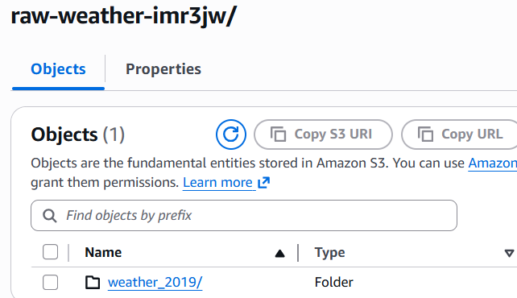

---

# 5️. AWS Glue 

AWS Glue was used to automatically detect schema and make both accident and weather datasets queryable via Athena.

---

## 5.1 Glue Database

A new Glue database was created with the name:

```
traffic_project_db
```
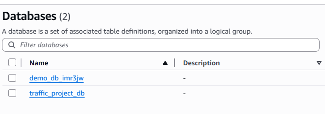

---

## 5.2 Glue Crawler Setup

A Glue Crawler was configured to scan the raw data folders in S3 and automatically detect table structure.

### Crawler Configuration Summary
- **Data sources included:**
  - raw-accidents-imr3jw
  - raw-weather-imr3jw
- **Target Database:**
  - traffic_project_db
- **IAM Role:**
  - LabRole (automatically applied in AWS Academy)
- **Crawl Type:**
  - “Crawl all subfolders”


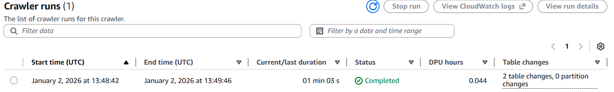

---

## 5.3 Results of the Crawler

Once executed, the crawler successfully created tables in the Glue Data Catalog.

Tables created included:
- Accident table
- Weather table

These tables then became accessible in Athena for querying and transformation.

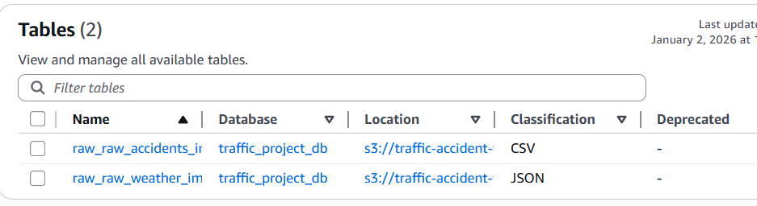

---

# 6️. Amazon Athena – Data Processing & Analytics

Amazon Athena was used to:
- transform raw datasets  
- join accident + weather data  
- create a curated analytics table  
- execute analytical queries to answer business questions

All queries were executed in the `traffic_project_db` database.

---

## 6.1 Creating a Simplified Weather Table

The raw weather JSON structure contains **hourly arrays**, which are difficult to query directly.  
Therefore, an aggregated daily weather table was created using Athena:

```sql
CREATE TABLE traffic_project_db.simple_weather AS
SELECT
    substr(time, 1, 10) AS iso_date,      
    AVG(hourly.temperature_2m[idx]) AS avg_temp,
    AVG(hourly.wind_speed_10m[idx]) AS avg_wind,
    SUM(hourly.precipitation[idx]) AS total_precip
FROM traffic_project_db.raw_raw_weather_imr3jw
CROSS JOIN UNNEST(hourly.time) WITH ORDINALITY AS t(time, idx)
GROUP BY 1
ORDER BY 1;
```

This table converts hourly weather into daily aggregated values.


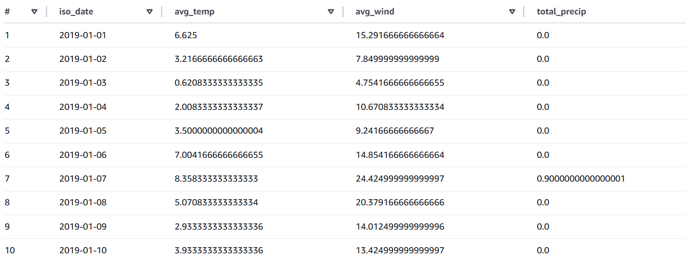

---

## 6.2 Creating the Curated Accident + Weather Table

Next, a curated analytics dataset was created by **joining accidents with weather** based on date.

```sql
CREATE TABLE traffic_project_db.curated_accident_weather
WITH (
    format = 'PARQUET',
    external_location = 's3://traffic-accident-weather-sara/curated-imr3jw/'
) AS
SELECT
    a.*,
    w.avg_temp,
    w.avg_wind,
    w.total_precip
FROM traffic_project_db.raw_raw_accidents_imr3jw a
LEFT JOIN traffic_project_db.simple_weather w
    ON
        CASE
            WHEN a.date IS NULL OR a.date = '' THEN NULL
            ELSE date_format(
                date_parse(a.date, '%d/%m/%Y'),
                '%Y-%m-%d'
            )
        END = w.iso_date
WHERE a.date IS NOT NULL
  AND a.date <> '';
```

Result:
- Stored as **Parquet** (faster + cheaper queries)
- Saved in curated S3 folder
- Ready for analysis


---

# 7️. Analytical Queries & Findings

The curated dataset was analyzed to answer business questions supporting emergency response planning.

---

## 7.1  Does rain increase accidents?

```sql
SELECT
    CASE 
        WHEN total_precip = 0 THEN 'No Rain'
        WHEN total_precip BETWEEN 0 AND 5 THEN 'Light Rain'
        ELSE 'Heavy Rain'
    END AS rain_group,
    COUNT(*) AS accidents
FROM traffic_project_db.curated_accident_weather
GROUP BY 1
ORDER BY accidents DESC;
```
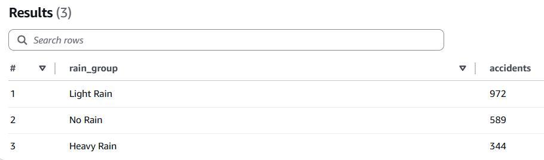

**Conclusion:**  
Most accidents occur during **light rain**, while heavy rain shows the lowest number.  
This may indicate that extreme rain leads to more careful driving, while light rain still degrades safety.

---

## 7.2  Are accidents more frequent at certain temperatures?

```sql
SELECT
    CASE
        WHEN avg_temp < 0 THEN 'Below 0°C'
        WHEN avg_temp BETWEEN 0 AND 10 THEN '0–10°C'
        WHEN avg_temp BETWEEN 10 AND 20 THEN '10–20°C'
        ELSE '20°C+'
    END AS temp_group,
    COUNT(*) AS accidents
FROM traffic_project_db.curated_accident_weather
GROUP BY 1
ORDER BY accidents DESC;
```

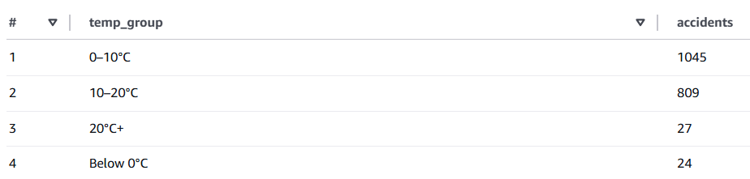

**Conclusion:**  
Accidents are most frequent in **moderate temperatures (0–20°C)**, with the highest number occurring between **0–10°C**. Very few accidents occur in extreme cold or heat, suggesting temperature alone is not a major risk factor.

---

## 7.3 Do higher wind speeds increase accidents?

```sql
SELECT
    CASE
        WHEN avg_wind < 5 THEN 'Low Wind'
        WHEN avg_wind BETWEEN 5 AND 10 THEN 'Moderate Wind'
        ELSE 'High Wind'
    END AS wind_group,
    COUNT(*) AS accidents
FROM traffic_project_db.curated_accident_weather
GROUP BY 1
ORDER BY accidents DESC;
```
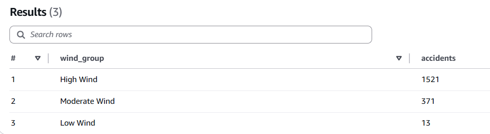
**Conclusion:**  
Yes, significantly more accidents occur in windy conditions.  
Wind bucket thresholds were validated using the **Beaufort Wind Scale**, so this classification is meteorologically meaningful.

---

## 7.4  Are casualty severities worse in extreme temperatures?

```sql
SELECT
    CASE
        WHEN avg_temp < 0 THEN 'Below 0°C'
        WHEN avg_temp BETWEEN 0 AND 10 THEN '0–10°C'
        WHEN avg_temp BETWEEN 10 AND 20 THEN '10–20°C'
        ELSE '20°C+'
    END AS temp_group,
    AVG(CAST("casualty class" AS DOUBLE)) AS avg_severity
FROM traffic_project_db.curated_accident_weather
GROUP BY 1
ORDER BY avg_severity DESC;
```
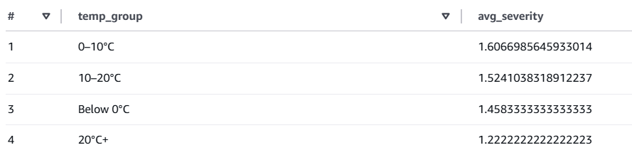

**Clarification:**

| casualty class | meaning |
|----------------|--------|
| 1 | Fatal |
| 2 | Serious |
| 3 | Slight |

**Interpretation:**  
Fatal accidents occur most frequently in **20°C+ warm weather**,  
while **0–10°C** tends to result in less severe outcomes.

---

## 7.5  Does wind affect severity?

```sql
SELECT
    CASE
        WHEN avg_wind < 5 THEN 'Low Wind'
        WHEN avg_wind BETWEEN 5 AND 10 THEN 'Moderate Wind'
        WHEN avg_wind BETWEEN 10 AND 20 THEN 'Strong Wind'
        ELSE 'Extreme Wind'
    END AS wind_group,
    AVG(CAST("casualty class" AS DOUBLE)) AS avg_severity,
    COUNT(*) AS accident_count
FROM traffic_project_db.curated_accident_weather
GROUP BY 1
ORDER BY avg_severity ASC;
```
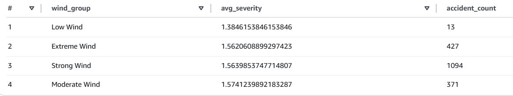

**Conclusion:**  
Differences are small, **no meaningful severity impact** detected.

---

## 7.6 Does rain cause accidents with more vehicles involved?

```sql
SELECT
    CASE 
        WHEN total_precip = 0 THEN 'No Rain'
        WHEN total_precip BETWEEN 0 AND 5 THEN 'Light Rain'
        ELSE 'Heavy Rain'
    END AS rain_group,
    AVG("number of vehicles") AS avg_vehicles
FROM traffic_project_db.curated_accident_weather
GROUP BY 1
ORDER BY avg_vehicles DESC;
```
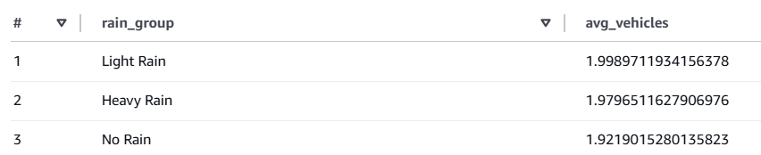

**Conclusion:**  
No meaningful pattern detected.

---

## 7.7 Which roads are most dangerous in rain?

```sql
SELECT
    "road class" AS road_class,
    CASE 
        WHEN total_precip = 0 THEN 'No Rain'
        WHEN total_precip > 0 AND total_precip <= 5 THEN 'Light Rain'
        ELSE 'Heavy Rain'
    END AS rain_group,
    COUNT(*) AS accidents
FROM traffic_project_db.curated_accident_weather
GROUP BY 1, 2
ORDER BY road_class, accidents DESC;
```
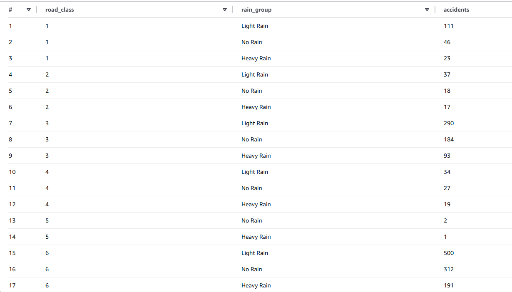
**Conclusion:**  
B-roads (class 3) show the highest accident frequency under rain,  
while motorways perform significantly better-

---

# 8️. Correlation Analysis

---

## Temperature vs Severity

```sql
SELECT 
    corr(
        avg_temp,
        CAST("casualty class" AS DOUBLE)
    ) AS temp_severity_correlation
FROM traffic_project_db.curated_accident_weather;
```

**Result:** `-0.04027` → No significant correlation

---

## Wind vs Number of Vehicles

```sql
SELECT 
    corr(
        avg_wind,
        CAST("number of vehicles" AS DOUBLE)
    ) AS wind_vehicles_correlation
FROM traffic_project_db.curated_accident_weather;
```

**Result:** `0.0009759` → No significant correlation

---

## Rain vs Casualties

```sql
SELECT 
    corr(
        total_precip,
        CAST("casualty number" AS DOUBLE)
    ) AS rain_casualties_correlation
FROM traffic_project_db.curated_accident_weather;
```
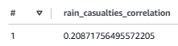

**Conclusion:**  
Weak positive relationship — rainfall slightly increases casualty counts, but not strongly.

---

# 9️. Note on Visualization (QuickSight Limitation)

Amazon QuickSight was originally planned as the visualization layer.  
However, AWS Academy Learner Lab does **not** allow QuickSight usage.

---


